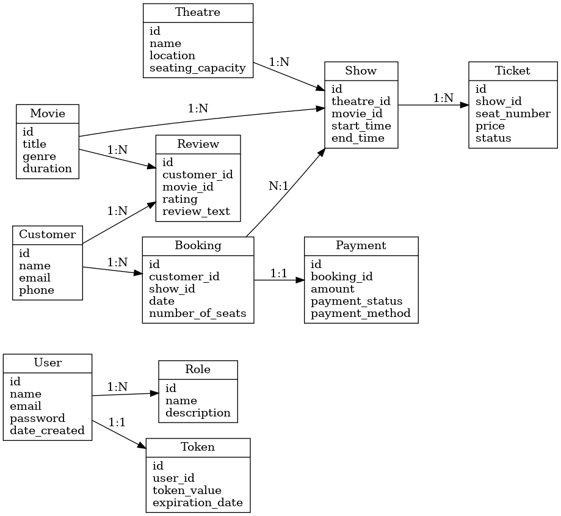
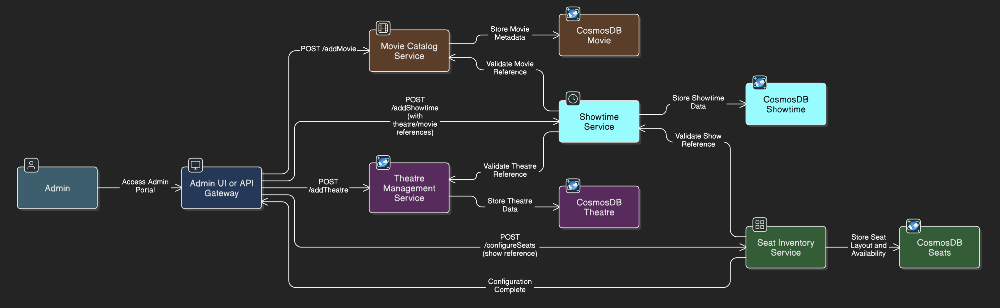
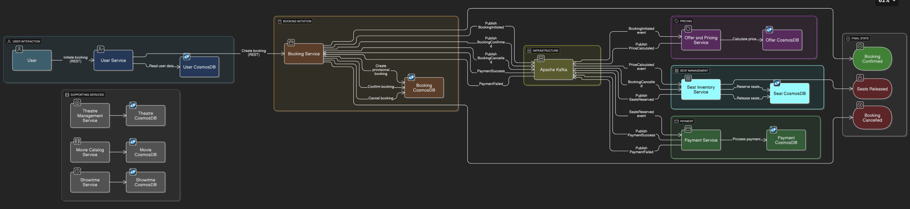
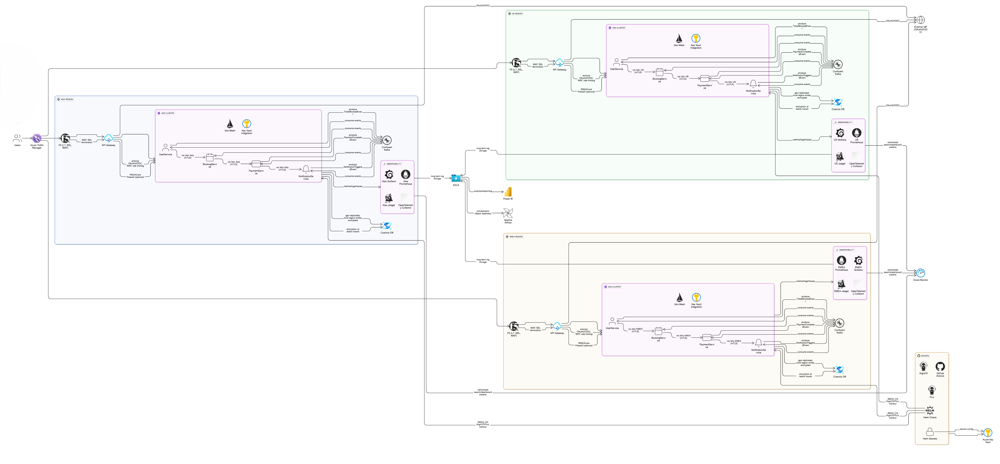

# 🎟️ Online Movie Ticket Booking System – XYZ Company

The **Online Movie Ticket Booking System** is a modern, cloud-native platform designed to streamline the process of browsing, selecting, and booking movie tickets across theaters in various cities. Built with a microservices architecture, it offers scalable, secure, and resilient services for both end users and theatre administrators. Customers can easily browse movies while theatre partners can manage their theatres, movies, shows, and seat arrangements through a powerful admin backend. The system ensures high availability, real-time seat tracking, and seamless payment integration to deliver a world-class moviegoing experience.

---

## 📘 Entity Relationship Diagram (ERD)

The ERD outlines the core entities and their relationships across microservices like User, Theatre Management, Booking, and Payment. This serves as the foundation of the data model.

---

## 👨‍💼 Admin Flow

This diagram describes how an admin user interacts with the system to onboard theatres, manage shows, add movies, configure seats, and set pricing and offers.

---

## 🙋‍♂️ Booking Flow

This section outlines the Booking journey.

---

## 🏗️ System Architecture

The following architecture diagram illustrates how the microservices interact with each other, including components such as API Gateway, Kafka for messaging, CosmosDB for storage, and AKS for deployment.

---

## 📁 Project Structure 

- /user-service # **Handles user registration, authentication, roles**
- /theatre-service # **Manages theatre, screen, and seat inventory**
- /movie-service # **Catalogs movies and metadata**
- /showtime-service # **Show scheduling logic**
- /booking-service # **Seat booking, lock & confirmation**
- /payment-service # **Integration with payment gateways**
- /offer-pricing-service # **Discount logic & dynamic pricing**

## 🚀 Tech Stack

- **Backend**: Spring Boot, Java 17
- **Database**: Azure CosmosDB
- **Messaging**: Apache Kafka
- **Deployment**: AKS (Azure Kubernetes Service)
- **Observability**: Prometheus, Grafana, Spring Boot Actuator
- **Security**: JWT, Role-based Access Control

